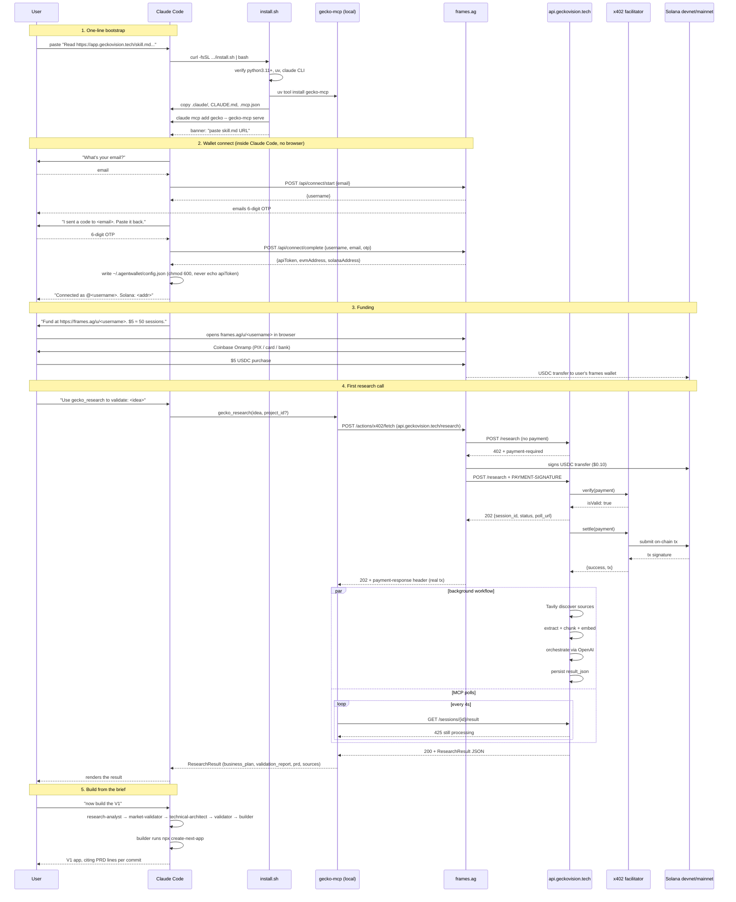

# End-to-end flow

The Gecko user journey, from one pasted line in Claude Code to a paid, on-chain-receipted research result with a full PRD ready for the `builder` sub-agent.

## Sequence

## Caption

The whole loop runs in roughly **3 minutes** from cold install to a research result in context: ~30 seconds for `install.sh`, ~30 seconds for the OTP exchange, ~30 seconds for funding (browser detour), ~60 seconds for the workflow itself, ~20 seconds for the polling cycle to converge. After that, every follow-up via `gecko_ask` is free, every paid extension via `extract-page` is ~$0.004, and the `builder` sub-agent treats `prd.acceptance_criteria` as the contract for when the V1 is done.

The user only handles two things directly: their email + OTP (~30 seconds), and Coinbase Onramp funding (~30 seconds). Everything else is orchestrated.
